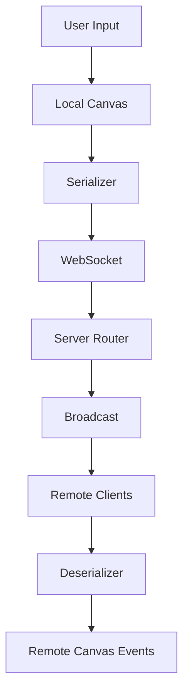

# 🏗️ Collaborative Canvas Architecture

## 📊 Data Flow Diagram



### Flow Description
1. User draws on local canvas (pointerdown/move/up events)
2. Points normalized to canvas percentages
3. Streamed via WebSocket as partial updates
4. Server broadcasts to room members
5. Remote clients denormalize and render incrementally

## 🔄 WebSocket Protocol

### Client -> Server Messages
```javascript
// Join room
{ type: 'join', roomId: string, userName: string }

// Partial stroke update (streaming)
{ 
  type: 'stroke:partial',
  stroke: {
    id: string,
    userId: string,
    tool: 'brush'|'eraser',
    color: string,
    width: number,
    points: [{xPct,yPct,t}],
    startIndex: number
  }
}

// Final stroke (committed)
{
  type: 'op:new',
  op: {
    type: 'stroke',
    stroke: {...} // same as partial
  }
}

// Cursor position
{
  type: 'cursor',
  xPct: number,
  yPct: number
}

// Undo/Redo
{ type: 'undo'|'redo', roomId: string }
```

### Server -> Client Messages
```javascript
// Full state on join
{
  type: 'full_state',
  operations: [...], // committed strokes
  users: [{id,name,color}]
}

// User updates
{
  type: 'user_list',
  users: [{id,name,color}]
}

// Forward stroke/cursor/op messages
// Same format as client->server
```

## ↩️ Undo/Redo Strategy

1. **Operation Log**
   - Maintain ordered list of committed operations
   - Each operation has unique ID and type
   - Operations are globally ordered

2. **Undo Process**
   - Remove last operation from active set
   - Broadcast undo to all clients
   - Clients rebuild canvas from remaining ops

3. **Redo Process**
   - Restore most recently undone op
   - Broadcast redo to all clients
   - Clients insert op and rebuild

## 🚀 Performance Optimizations

1. **Drawing Optimizations**
   - Linear interpolation only (no curves)
   - Device pixel ratio aware rendering
   - Throttled partial updates (60ms)
   - Incremental point streaming

2. **Network Optimizations**
   - Normalize coordinates to percentages
   - Send only new points in partial updates
   - Batch cursor updates
   - Room-based broadcasting

3. **Memory Management**
   - Reuse canvas backing buffer
   - Clean up remote cursors on disconnect
   - Limit stroke history size

## 🤝 Conflict Resolution

1. **Drawing Conflicts**
   - Last-writer-wins for overlapping strokes
   - Server assigns global operation order
   - All clients apply ops in same sequence

2. **Undo/Redo Conflicts**
   - Single undo/redo stack per room
   - Server enforces operation ordering
   - Clients rebuild canvas on changes

3. **Cursor Conflicts**
   - Each user has unique color
   - Cursors rendered in separate layer
   - Position updates don't conflict
